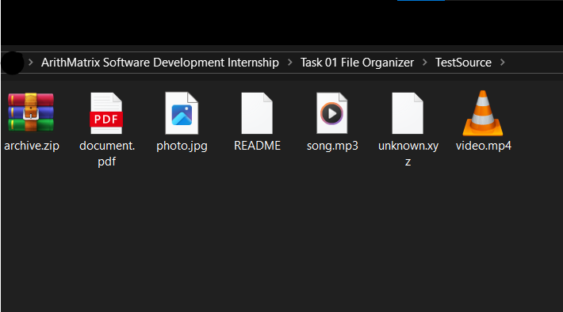
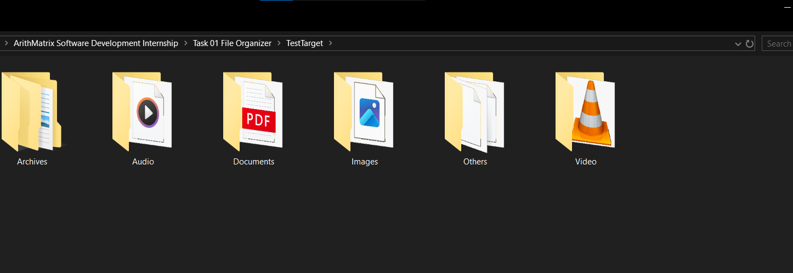
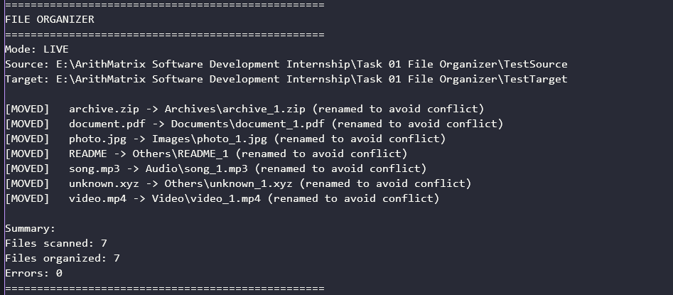
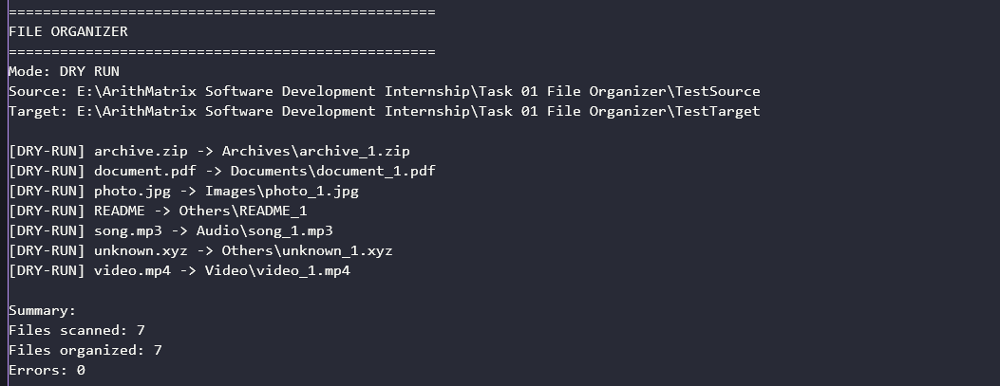

<p align="center">
  
</p>

<p align="center">
  
</p>
<div align="center">

[]()
[]()
[]()
[]()
[]()

**ArithMatrix Virtual Internship Program 2026 — Software Development Track**

</div>

<br />

## About The Project

The **File Organizer** is a robust, command-line interface (CLI) application built with C# and .NET 9. It automates the tedious process of sorting mixed files from a source directory into logically categorized subfolders within a target directory. 

Designed with clean architecture and separation of concerns, this tool evaluates file extensions, safely handles edge cases (like missing extensions or naming conflicts), and provides transparent logging—all without overwriting existing user data.

---

## The Problem

- **Cluttered Workspaces**: Download and working directories quickly become disorganized mixes of images, documents, archives, and media.
- **Manual Sorting is Error-Prone**: Manually moving hundreds of files is repetitive and risks accidental deletion or overwriting.
- **Naming Collisions**: Moving files with identical names can result in data loss if not handled deterministically.
- **Edge Cases**: Files without extensions or with unknown formats are often ignored or mishandled by basic scripts.

**The Solution**: A deterministic, automated CLI tool that classifies, resolves conflicts safely, and organizes files with a single command, complete with a `--dry-run` mode for risk-free previewing.

---

## Key Features

- **Automatic Classification**: Sorts files into `Images`, `Documents`, `Archives`, `Audio`, `Video`, and `Others` based on extension.
- **Configurable Paths**: Accepts dynamic `--source` and `--target` directories via CLI arguments or a configuration file.
- **Zero Data Loss**: **Never** overwrites existing files. Employs a deterministic conflict resolution strategy (`file_1.ext`, `file_2.ext`).
- **Dry-Run Mode**: Previews all planned operations without making any changes to the filesystem.
- **Edge Case Handling**: Safely processes files with multiple dots (e.g., `archive.tar.gz`), unknown extensions, and files with no extension at all.
- **Comprehensive Logging**: Provides clear, structured console output and optional file logging for audit trails.
- **Automated Testing**: Backed by a suite of 34 xUnit tests covering classification, conflicts, dry-run behavior, and error handling.

---

## Supported File Categories

| Category | Supported Extensions |
| :--- | :--- |
| **Images** | `.jpg`, `.jpeg`, `.png`, `.gif`, `.bmp`, `.webp`, `.svg`, `.tiff`, `.heic` |
| **Documents** | `.pdf`, `.doc`, `.docx`, `.txt`, `.rtf`, `.xls`, `.xlsx`, `.csv`, `.ppt`, `.pptx`, `.odt`, `.md` |
| **Archives** | `.zip`, `.rar`, `.7z`, `.tar`, `.gz`, `.bz2`, `.xz` |
| **Audio** | `.mp3`, `.wav`, `.flac`, `.aac`, `.ogg`, `.m4a`, `.wma` |
| **Video** | `.mp4`, `.mkv`, `.avi`, `.mov`, `.wmv`, `.webm`, `.flv`, `.m4v` |
| **Others** | Unknown extensions or files with **no extension** (e.g., `README`) |

---

## How It Works

1. **Parse Arguments**: Reads CLI flags (`--source`, `--target`, `--dry-run`, etc.) or loads a config file.
2. **Validate Paths**: Ensures the source directory exists and that the target is not the same as, or nested inside, the source.
3. **Scan Files**: Enumerates files in the source directory (ignoring subdirectories unless `--recursive` is specified).
4. **Extract & Classify**: Identifies the file extension and maps it to a category using a case-insensitive dictionary lookup.
5. **Prepare Destination**: Creates the target category folder if it does not already exist (skipped in Dry-Run).
6. **Resolve Conflicts**: Checks if the destination filename exists. If so, appends `_1`, `_2`, etc., before the final extension.
7. **Execute Move**: Safely moves the file using `File.Move` with `overwrite: false` as a final safeguard.
8. **Log & Summarize**: Records each operation and prints a final summary of scanned, organized, and errored files.

---

## CLI Usage

### Standard Organization
```bash
dotnet run --project src\FileOrganizer -- --source "C:\Users\Me\Downloads" --target "C:\Users\Me\Organized"
```

### Dry-Run Mode (Preview Only)
```bash
dotnet run --project src\FileOrganizer -- --source "C:\Users\Me\Downloads" --target "C:\Users\Me\Organized" --dry-run
```

### Using a Configuration File
```bash
dotnet run --project src\FileOrganizer -- --config "config.txt"
```
*(Config file format: `key=value` per line, e.g., `source=C:\Downloads`)*

### Additional Options
- `--recursive`: Include files in subdirectories of the source.
- `--log <path>`: Save the operation log to a specified text file.

---

## Before / After Example

**Before (`TestSource/`)**
```text
TestSource/
├── photo.jpg
├── document.pdf
├── song.mp3
├── video.mp4
├── archive.zip
├── unknown.xyz
└── README
```

**After (`TestTarget/`)**
```text
TestTarget/
├── Images/
│   └── photo.jpg
├── Documents/
│   └── document.pdf
├── Audio/
│   └── song.mp3
├── Video/
│   └── video.mp4
├── Archives/
│   └── archive.zip
└── Others/
    ├── README
    └── unknown.xyz
```

---

## Conflict Resolution

The application guarantees **no data loss** through deterministic renaming. If a file with the same name exists in the destination, the incoming file is renamed by appending an incrementing counter *before* the final extension.

- `report.pdf` → `report_1.pdf`
- `report_1.pdf` (if it also exists) → `report_2.pdf`
- `project.final.report.pdf` → `project.final.report_1.pdf` *(Correctly preserves the base name, not `project_1.final.report.pdf`)*

---

## Dry-Run Mode

The `--dry-run` flag allows you to validate the organization logic without modifying the filesystem. No directories are created, and no files are moved.

**Sample Output:**
```text
==================================================
 FILE ORGANIZER
==================================================
 Mode: DRY RUN
 Source: C:\TestSource
 Target: C:\TestTarget

 [DRY-RUN] photo.jpg -> Images\photo.jpg
 [DRY-RUN] document.pdf -> Documents\document.pdf
 [DRY-RUN] unknown.xyz -> Others\unknown.xyz

 Summary:
 Files scanned: 3
 Files organized: 3
 Errors: 0
==================================================
```

---

## Project Structure

```text
Task 01 File Organizer/
├── src/
│   └── FileOrganizer/          # Main application source code
│       ├── Models/             # Data records (Options, Results, Categories)
│       ├── Services/           # Core logic (Classifier, ConflictResolver, Organizer)
│       ├── Configuration/      # CLI argument and config file parsing
│       ├── Logging/            # Console and file logging utilities
│       └── Program.cs          # Application entry point
├── tests/
│   └── FileOrganizer.Tests/    # xUnit automated test suite
├── examples/
│   └── sample_run.log          # Sample execution log
├── screenshots/                # Visual proof of execution
├── FileOrganizer.sln           # Visual Studio Solution file
├── README.md                   # This documentation
├── GUIDE.md                    # Comprehensive technical guide
└── .gitignore                  # Git ignore rules for .NET
```

---

## Testing & Quality Assurance

The project includes a comprehensive automated test suite built with **xUnit**, utilizing temporary, isolated directories to ensure no impact on the host filesystem.

- **Total Tests**: 34
- **Passed**: 34 ✅
- **Failed**: 0
- **Skipped**: 0

**Test Coverage Includes:**
- Extension classification (case-insensitive, multiple dots, no extension).
- Deterministic conflict resolution sequences.
- Dry-run mode verification (ensuring zero filesystem mutations).
- Invalid path handling and source/target overlap prevention.

Run tests locally:
```bash
dotnet test
```

---

## Sample Run Output

```text
==================================================
 FILE ORGANIZER
==================================================
 Mode: NORMAL
 Source: E:\ArithMatrix Software Development Internship\Task 01 File Organizer\TestSource
 Target: E:\ArithMatrix Software Development Internship\Task 01 File Organizer\TestTarget

 [MOVED]   photo.jpg -> Images\photo.jpg
 [MOVED]   document.pdf -> Documents\document.pdf
 [MOVED]   song.mp3 -> Audio\song.mp3
 [MOVED]   video.mp4 -> Video\video.mp4
 [MOVED]   archive.zip -> Archives\archive.zip
 [MOVED]   README -> Others\README
 [MOVED]   unknown.xyz -> Others\unknown.xyz

 Summary:
 Files scanned: 7
 Files organized: 7
 Errors: 0
==================================================
```

---

## Screenshots

*(Ensure these files exist in your `screenshots/` directory before pushing to GitHub)*

| Before Organization | After Organization |
| :---: | :---: |
|  |  |
| **Successful Execution** | **Dry-Run Preview** |
|  |  |

---

## Installation & Setup

### Prerequisites
- [.NET 9 SDK](https://dotnet.microsoft.com/download/dotnet/9.0)
- Git

### 1. Clone the Repository
```bash
git clone https://github.com/abdallasamir04/ArithMatrix-Software-Development-Internship.git
```

### 2. Navigate to the Task Directory
```bash
cd "ArithMatrix-Software-Development-Internship/Task 01 File Organizer"
```

### 3. Restore Dependencies & Build
```bash
dotnet restore
dotnet build
```

### 4. Run Tests
```bash
dotnet test
```

### 5. Execute the Application
```bash
dotnet run --project src\FileOrganizer -- --source "<Your_Source_Path>" --target "<Your_Target_Path>"
```

---

## Engineering Notes

This project demonstrates several core software engineering principles:
- **Separation of Concerns**: Classification logic (`FileClassifier`) and conflict resolution (`ConflictResolver`) are decoupled from filesystem execution (`FileOrganizerService`), enabling pure, fast unit testing.
- **Defensive Programming**: Explicit guards prevent catastrophic errors (e.g., rejecting `Source == Target` to prevent infinite recursive processing).
- **Deterministic Algorithms**: Conflict resolution relies on predictable, sequential naming rather than random GUIDs or timestamps, ensuring reproducible results.
- **Modern C# Features**: Utilizes `record` types for immutable data transfer, pattern matching (`is ... or ...`), and file-scoped namespaces for clean, readable code.

---

## Internship Context

This project was developed as part of the:
**ArithMatrix Virtual Internship Program (AVIP) 2026**  
*Software Development Track*  
**Task 01 — File Organizer**

It fulfills all official internship requirements, including CLI configuration, dry-run capabilities, deterministic conflict resolution, automated testing, and comprehensive documentation.

---

## Project Status

- [x] File classification by extension
- [x] Category-based folder creation
- [x] Configurable source/target directories
- [x] Deterministic conflict resolution (no overwrites)
- [x] Dry-run mode implementation
- [x] Unknown and extensionless file handling
- [x] Automated testing (34/34 passed)
- [x] Comprehensive documentation & README
- [x] Sample run log & screenshots

---

## Future Improvements

*Note: These are potential enhancements, not currently implemented features.*
- Integration of GitHub Actions for CI/CD and automated test runs on push.
- Custom support, user-defined classification rules via JSON configuration.
- Richer CLI UX with progress bars for directories containing thousands of files.
- Structured logging (e.g., JSON output) for easier integration with log aggregation tools.

---

## Author

**Abdalla Mahmoud Samir**  

---

<p align="center">
  <sub>Built with C# and .NET 9 as part of the ArithMatrix Virtual Internship Program 2026</sub>
  <br />
  
</p>
